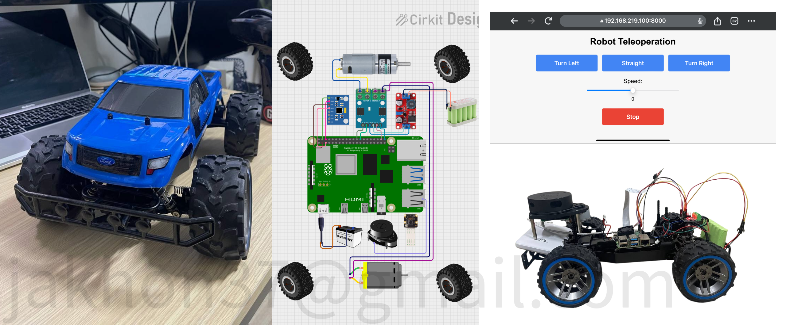

# RC Robot with Teleop Web GUI & Integrated ROS2 Nodes

In this project we are converting rgular RC Car to autonomus vehicle. 
The project provides a solution for controlling a ROS2-based robot, an autonomous RC car from a web interface on a smartphone. It includes:
- A **responsive web GUI** (built with HTML/CSS/JavaScript) that sends live control commands (Twist messages) to the robot.
- ROS2 nodes for:
  - **Motor Control:** Receives `/cmd_vel` commands and controls drive/steering motors via a motor driver.
  - **IMU:** Reads data from an MPU6050 sensor over I²C and publishes IMU data.
  - **Lidar:** Integrates a RPLIDAR (or compatible) sensor and publishes LaserScan messages.

--- 

---
## TO DO
- 💭 **SLAM** to careate enviorenment map and localize the car
- 💭 **Navigation** to autonomously drive and find a best path to reach the target point 
- 💭 **Path Planning AI** train RL agnet to navigate on usneen enviorenments without a map
- 💭 **Object Detection** for better localization and navigation
- ✅ **Remote Motor Control** web based gui to control car


---

## Table of Contents

- [Features](#features)c
- [Prerequisites](#)
- [Project Setup and Node Creation](#project-setup-and-node-creation)
  - [ROS2 Workspace Setup](#ros2-workspace-setup)
  - [Motor Control Node](#motor-control-node)
  - [IMU Node](#imu-node)
  - [Lidar Node](#lidar-node)
- [Web GUI Setup](#web-gui-setup)
- [Usage](#usage)
- [To Do List](#to-do-list)
- [Troubleshooting](#troubleshooting)
- [License](#license)
- [Acknowledgements](#acknowledgements)

---

## Features

- **Responsive Web GUI:** Optimized for mobile devices.
- **Real-Time Control:** Commands are sent immediately upon interaction.
- **ROS2 Integration:** Nodes for motor control, IMU data, and lidar scanning.
- **Local Communication:** Uses a locally built copy of roslibjs and rosbridge for WebSocket-based communication.
- **Extensible:** Easily integrate additional sensors or controls (e.g., virtual joystick).

---

## Prerequisites

- **ROS2 Installation:** (e.g., ROS2 Humble on Ubuntu 22.04)

The web GUI communicates with ROS using [roslibjs](https://github.com/RobotWebTools/roslibjs) via a locally hosted copy and [rosbridge_suite](https://github.com/RobotWebTools/rosbridge_suite).

- **rosbridge_suite:**  
  Install and run the rosbridge server on your ROS machine:
  ```bash
  sudo apt install ros-humble-rosbridge-server
  ros2 run rosbridge_server rosbridge_websocket
  ```
- **Network Connectivity:**  
  Ensure your smartphone and ROS machine are on the same network.
- **Hardware Setup:**
  - **Motor Control:** Wiring for drive and steering motors via an L9110 motor driver.
  - **IMU:** MPU6050 sensor connected via I²C.
  - **Lidar:** RPLIDAR or SLAMTEC Lidar connected via USB (or appropriate interface).
- **Local HTTP Server:**  
  To serve the web interface (e.g., Python’s HTTP server).

---

## Project Setup and Node Creation

### ROS2 Workspace Setup

1. **Create a ROS2 Workspace (if you haven't already):**
   ```bash
   mkdir -p ~/ros2_ws/src
   cd ~/ros2_ws/src
   ```
   
2. **Clone or Create Your ROS2 Packages:**

   - **Motor Control Node:**  
     Create a Python package for motor control.
     ```bash
     ros2 pkg create --build-type ament_python motor_control --dependencies rclpy geometry_msgs
     ```
     
   - **IMU Node:**  
     Create a Python package for the MPU6050-based IMU.
     ```bash
     ros2 pkg create --build-type ament_python mpu6050_imu --dependencies rclpy sensor_msgs
     ```
     
   - **Lidar Node:**  
     You can either use an existing package (such as [sllidar_ros2](https://github.com/Slamtec/sllidar_ros2) or [rplidar_ros](https://github.com/roboception/rplidar_ros)) or create your own. For this project, ```we use ros-humble-rplidar-ros```
      here other example:
     ```bash
     cd ~/ros2_ws/src
     git clone https://github.com/Slamtec/sllidar_ros2.git
     ```

3. **Implement the Nodes:**

   ### Motor Control Node
   - **File:** `~/ros2_ws/src/motor_control/motor_control/motor_controller.py`
   - **Overview:**  
     This node subscribes to the `/cmd_vel` topic and controls the drive (back) and steering (front) motors via GPIO using PWM.
   - **GPIO PIN CONNCETION**
  
     BACK_MOTOR_PIN1 = 17
     BACK_MOTOR_PIN2 = 18
     FRONT_MOTOR_PIN1 = 27
     FRONT_MOTOR_PIN2 = 22

    
     ```
   - **Build the Package:**
     ```bash
     cd ~/ros2_ws
     colcon build --packages-select motor_control
     source install/setup.bash
     ```

   ### IMU Node
   - **File:** `~/ros2_ws/src/mpu6050_imu/mpu6050_imu/mpu6050_node.py`
   - **Overview:**  
     This node reads data from an MPU6050 sensor over I²C and publishes `sensor_msgs/Imu` messages.
   - **GPIO PIN CONNCETION**

     MPU6050_ADDR = 0x68
     PWR_MGMT_1   = 0x6B
     ACCEL_XOUT_H = 0x3B
     GYRO_XOUT_H  = 0x43

     ```
   - **Build the Package:**
     ```bash
     cd ~/ros2_ws
     colcon build --packages-select mpu6050_imu
     source install/setup.bash
     ```

   ### Lidar Node

   - **Installation:**  
     install ready rplidar packages 
     ```bash
      sudo apt install ros-humble-rplidar-ros

     ```

   - **Running the Lidar Node:**  
     Use the provided launch files or run the node directly. For example:
     ```bash
     ros2 launch sllidar_ros2 view_sllidar_a1_launch.py
     ```
    
     or on terminal
    ```
    ros2 run rplidar_ros rplidar_composition --ros-args \
    -p serial_port:=/dev/ttyUSB0 \
    -p serial_baudrate:=115200 \
    -p frame_id:=lidar_link \
    -p angle_compensate:=true \
    -p scan_mode:=Standard
    ```

---

## Web GUI Setup

1. **Local Copy of ROSLIB:**  
   Since pre-built files for ROSLIB v2 are no longer provided by default, either:
   - **Option A:** Download a stable v1 release of `roslib.min.js` from [jsDelivr](https://cdn.jsdelivr.net/npm/roslib/build/roslib.min.js) and save it in your project folder.
   - **Option B:** Use NPM to install and build ROSLIB locally:
     ```bash
     npm init -y
     npm install roslib
     ```
     Then copy the built/minified file (`roslib.min.js`) from `node_modules/roslib/` (or from the build output folder) to your project folder.
2. **Web GUI Files:**  
   Your project folder should include:
   - `index.html` – [the teleop GUI code ](launch/index.html)
   - `roslib.min.js` – [the locally hosted JavaScript file](launch/roslib.min.js)


---

## Usage

1. **Start ROS2 Nodes:**

   - **Motor Control Node:**
     ```bash
     ros2 run motor_control motor_controller
     ```
   - **IMU Node:**
     ```bash
     ros2 run mpu6050_imu mpu6050_node
     ```
   - **Lidar Node:**  
     Either run the provided launch file (for example):
     ```bash
     ros2 launch sllidar_ros2 view_sllidar_a1_launch.py
     ```
     or run the node directly if applicable.

2. **Start the rosbridge Server:**
   ```bash
   ros2 run rosbridge_server rosbridge_websocket
   ```

3. **Serve the Web GUI:**
   In the folder containing `index.html` and `roslib.min.js`:
   ```bash
   python3 -m http.server 8000
   ```

4. **Access the GUI:**
   Open your smartphone or computer browser and navigate to:
   ```
   http://<YOUR_ROBOT_IP>:8000/index.html
   ```
   Replace `<YOUR_ROBOT_IP>` with the IP address of the machine serving the web page.

5. **Control the Robot:**
   - Adjust the speed slider for forward/backward motion.
   - Tap steering buttons to change direction.
   - Tap the stop button to halt the robot.
   
   Verify the commands are received by checking:
   ```bash
   ros2 topic echo /cmd_vel
   ```


## Troubleshooting

- **WebSocket Connection Issues:**  
  If the browser console logs errors (e.g., `ROSLIB is not defined` or connection errors), verify:
  - `roslib.min.js` is present in your project folder.
  - The WebSocket URL in your `index.html` is correct.
- **No Command Response:**  
  Ensure:
  - The rosbridge server is running.
  - The motor control node is correctly wired and receiving `/cmd_vel` commands.
- **Hardware Issues:**  
  Verify that the motors, IMU, and lidar are properly connected and powered.

---

## License

This project is released under the [MIT License](LICENSE).

---

## Acknowledgements

- [Robot Web Tools](http://robotwebtools.org/) for roslibjs and rosbridge_suite.
- The ROS community for continuous support and documentation.
